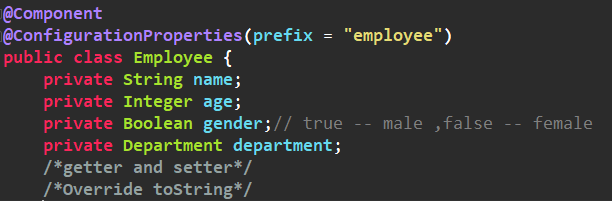
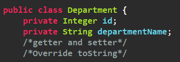
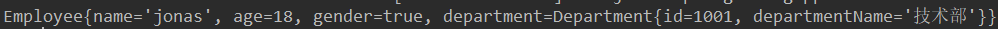
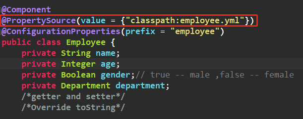
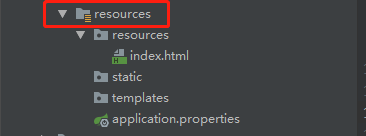
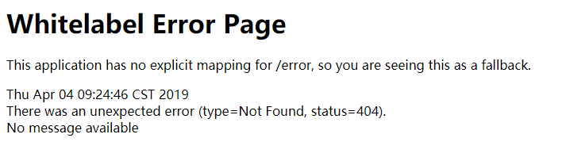

# Spring Boot 

------

## 一、Spring Boot 入门

### 1、Spring Boot 简介

-----

​	`Spring Boot` 是为了简化 `Spring` 应用的创建、运行、调试、部署等一系列问题而衍生的产物，自动装配的特性让我们可以更好的关注业务本身而不是外部的 XML 配置文件，我们只需遵循规范，引入相关的依赖就可以轻易的搭建一个 WEB 工程。

​	未接触 `Spring Boot` 之前，搭建一个普通的 `WEB` 工程往需要花费30分钟左右，如果遇到点问题可能还会耽误更长的时间，但使用了 `Spring Boot` 之后，真正体会到了什么叫分分钟搭建一个工程，从此摆脱了 XML和一大堆 jar包 的恐惧。

​	一句话总结 `Spring Boot`：简化 Spring 应用开发；整个 Spring 技术栈大整合；J2EE 开发的一站式解决方案。


### 2、环境准备

-----------

- jdk 1.8 或以上
- maven 3.3 或以上
- IDE 推荐使用 IDEA 
- Spring Boot 2.1.3


### 3、从一个 Hello World 开始

------------

#### 1.创建一个 Maven 工程，JDK选择1.8


GroupId 一般为域名逆序，ArtifactId 一般填写项目名：


进入到项目后 IDEA 在右下方会弹框，点击 **Enable Auto-Import** 自动导入：


#### 2. pom.xml 配置相关依赖

```xml
<?xml version="1.0" encoding="UTF-8"?>
<project xmlns="http://maven.apache.org/POM/4.0.0"
         xmlns:xsi="http://www.w3.org/2001/XMLSchema-instance"
         xsi:schemaLocation="http://maven.apache.org/POM/4.0.0 http://maven.apache.org/xsd/maven-4.0.0.xsd">
    <modelVersion>4.0.0</modelVersion>

    <groupId>com.jonas</groupId>
    <artifactId>HelloSpringBoot</artifactId>
    <version>1.0-SNAPSHOT</version>

    <!-- 继承spring-boot项目 -->
    <parent>
        <groupId>org.springframework.boot</groupId>
        <artifactId>spring-boot-starter-parent</artifactId>
        <version>2.1.3.RELEASE</version>
    </parent>


    <dependencies>
        <!-- 引入web环境的启动器 -->
        <dependency>
            <groupId>org.springframework.boot</groupId>
            <artifactId>spring-boot-starter-web</artifactId>
        </dependency>
    </dependencies>

</project>
```

#### 3. 编写一个主程序

```java
import org.springframework.boot.SpringApplication;
import org.springframework.boot.autoconfigure.SpringBootApplication;

@SpringBootApplication
public class HelloSpringBoot {
    public static void main(String[] args){
        SpringApplication.run(HelloSpringBoot.class,args);
    }
}
```

注解 `@SpringBootApplication` 用于标注一个主程序类，说明这是一个 `Spring Boot` 应用。

#### 4.编写一个 Controller

编写一个 Controller 用于处理 hello 请求，直接往页面中打印 hello world：


#### 5. 运行主程序类

测试结果：


包结构如下：


主程序所在包一定要包含所有类所在的子包，原因在后面解析。


### 4、初探 Hello World

#### 1. pom 文件

##### i.父项目

在 pom 文件中，一上来我们就引入了一个父项目：

```xml
<parent>
        <groupId>org.springframework.boot</groupId>
        <artifactId>spring-boot-starter-parent</artifactId>
        <version>2.1.3.RELEASE</version>
</parent>
```

点击`spring-boot-starter-parent`进入父项目，可以发现，父项目里面还有一个父项目 `spring-boot-dependencies`：

```xml
<parent>
        <groupId>org.springframework.boot</groupId>
        <artifactId>spring-boot-dependencies</artifactId>
        <version>2.1.3.RELEASE</version>
        <relativePath>../../spring-boot-dependencies</relativePath>
</parent>
```

在`spring-boot-dependencies`项目中，管理着一大堆 `Spring Boot` 的依赖，这是 `Spring Boot` 的版本仲裁中心，以后我们导入的依赖默认不需要写版本，因为版本的控制已经交给 `Spring Boot` 了（当然，如果你引入的依赖没有在 dependencies 里面管理着自然需要声明版本号）。

##### ii.启动器

回到 pom 文件中，除了引入了父项目以外，还定义了一个依赖：

```xml
<dependencies>
        <!-- 引入web环境的启动器 -->
        <dependency>
            <groupId>org.springframework.boot</groupId>
            <artifactId>spring-boot-starter-web</artifactId>
        </dependency>
</dependencies>
```

在没有使用 `Spring Boot` 之前，我们如果需要 web 环境则需要我们去引入相关的 jar 包或者依赖配置，然而 Spring Boot 将这里所谓的环境进行了一个整合，将所有的功能场景都抽取出来，做成一个个 `starters`（启动器），只需要在项目里面引入这些  `starter` ，相关场景的所有依赖都会导入近来。也就是说，用什么功能就导入什么场景的启动器。具体到这个例子，`spring-boot-starter-web`启动器就帮我们导入了web场景所需要的所有依赖。

#### 2.主程序类

```java
@SpringBootApplication
public class HelloSpringBoot {
    public static void main(String[] args){
        SpringApplication.run(HelloSpringBoot.class,args);
    }
}
```

`@SpringBootApplication` 用于标识在某个类上说明这个类是 `Spring Boot` 的主配置类，`Spring Boot` 就应该运行这个类的 `main` 方法来启动 `Spring Boot` 应用。

点击 `@SpringBootApplication` 注解进入源码看到：


`@SpringBootConfiguration` ：`Spring Boot` 的配置类，标注在一个类上，表示一个配置类（Spring Boot 将配置也抽取成一个类了）。

`@EnableAutoConfiguration` ：开启自动配置功能。以前我们需要配置的东西，Spring Boot 帮我们进行了自动配置，这个注解就是告诉 Spring Boot 开启自动配置功能。


`@AutoConfigurationPackage` ：自动配置包。点击进入注解：


`@Import(AutoConfigurationPackages.Registrar.class)` ：给容器导入一个组件。emmm，那么这里导入的是什么东西呢？点击 `Registrar` 进入看看：


通过计算发现，导入的包名就是我们定义的主程序类所在的包！！！

**也就是说，`@Import` 的作用就是将主配置类（使用 `@SpringBootApplication` 标注的类）所在包以及下面所有子包里面的所有组件扫到 Spring 容器中！！**

这也就说解析了前面提到的要将控制器类所在的包作为主程序类包的子包，因为它会默认扫描啊，如果放到主程序包的外面那么你的控制器就无法处理请求了，页面就是恶心的 404 了~~


### 5、一键创建 Spring Boot 工程

嘿嘿，直接上图：
 


然后填写 GAV 等信息就创建成功了，通过这种方式创建的我们就不需要手动在 pom 里面引入父项目和启动器了，父项目默认继承了，而启动器在创建前可以通过图形化界面的方式勾选具体的场景，然后在 pom 中就给我们自动引入了，方便多了。

## 二、配置文件

### 1、全局配置文件

------

在使用(上一篇最后提到的) `Spring Initalizr` 来创建项目时，在项目中会自动帮我们创建了一个配置文件 `application.properties` ：


这个就是 `Spring Boot` 应用的全局配置文件。除了我们熟悉的 ` properties` 配置文件以外，`Spring Boot` 也支持 `yml` 格式的配置文件，如果我们需要使用使用 `yml` 配置文件，就直接在 `resources` 目录下创建一个名为 `application.yml` 的配置文件即可。下面就先来简单的介绍这种 `yml` 的语法。

### 2、YML 语法

- 以 `k：（空格）v ` 来表示一对键值对，空格不能省略；以缩进来控制层级关系。

- 对于 v 而言，可以有以下表示方法：

  - 字符串，默认不需要写引号

  - 对象，Map 可以通过缩进的方式表示。也可以通过行内表达：{k1:v1,k2:v2...}

  - 数组，- 元素，也可以通过行内表示：[元素1，元素2...]

    

### 3、配置文件装配bean

#### 1. @ConfigurationProperties 装配 Bean

配置文件：

```yaml
employee:
    name: jonas
    age: 18
    gender: true
    department:
        id: 1001
        departmentName: 技术部
```

JavaBean：





注解 `ConfigurationPropertiese`：告诉 `Spring Boot` 将本类中的所有属性和配置文件中相关的配置进行绑定，通过 `prefix` 属性指定配置文件中具体的哪个对象。

在测试环境中直接注入 `Employee` 并输出：

```java
@RunWith(SpringRunner.class)
@SpringBootTest
public class SpringConfigApplicationTests {

    @Autowired
    Employee employee;

    @Test
    public void contextLoads() {
        System.out.println(employee);
    }

}
```

结果：



注意：

1.只有容器组件才能使用该注解（想想也知道，如果一个类都不在容器中，人家怎么给你注入进来呢）。

2.加上该注解后 IDE 会报个红线，具体的意思就是缺少一个配置文件的处理器，然后按照提示在 `pom` 中添加对应的依赖即可：

```xml
<dependency>
            <groupId>org.springframework.boot</groupId>
            <artifactId>spring-boot-configuration-processor</artifactId>
            <optional>true</optional>
</dependency>
```

3.`Spring Boot` 在默认情况下会加载应用的全局配置文件（`application.properties` 或者 `application.yml` ），所以上面 `@ConfigurationProperties` 指定的 `prefix` 会在全局配置里面找映射关系，但是如果将一个 `Bean` 配置在全局配置文件有点不妥当吧，所以就有了下面的方式。

#### 2.@PropertySource

`@PropertySource` 的作用是加载指定的配置文件。在 `Bean` 上加上该注解：



定义配置文件 `employee.yml` ：

```yaml
employee:
    name: jonas
    age: 18
    gender: true
    department:
        id: 1001
        departmentName: 技术部
```

测试结果与上面的一致，也是OK的。

#### 4.使用最原始的配置方式

`@ImportResource` ：导入 `Spring ` 的配置文件，通过这个注解就可以定义最原始的 `xml` 配置文件来进行装配 `Bean` 。这里不做介绍了。


#### 5.通过配置类的方式装配

**使用 `@Configuration` 来标识一个配置类，然后在类中通过 `@Bean` 标识方法，方法的返回值就是就会被添加到容器中，而这个 `Bean` 的 `id` 就是方法名。**

定义配置类，使用 `@Configuration` 标注：

```java
@Configuration
public class BeanConfig {
    @Bean
    public Employee employeeBean(){
        Department department = new Department(1001, "技术部");
        return new Employee("jonas",18,true,department);
    }
}
```

在测试环境中输出该 `Bean` ：


结果无误。


### 4、多 Prifile 环境

在实际开发中往往存在着多种环境，比如开发环境，测试环境，生产环境。然而，`Spring Boot` 也替我们想好了处理办法，就是我们在主配置文件编写的时候，文件名可以是 `application-{profile}.properties/yml` ，然后在配置文件中指定 `spring.profiles.active = dev` 指定 `profile` 。

```yaml
---
# 开发环境
server:
    port: 8083
spring:
    profiles:
        active: dev # 激活开发环境


---
# 测试环境
server:
    port: 8081
spring:
    profiles: test

---
# 生产环境
server:
    port: 8082
spring:
    profiles: prod

---
```

运行并查看日志信息：


结果就是我们指定的8083开发环境端口。


### 5、配置文件的加载位置以及加载优先级

我们都知道 `Spring Boot` 启动的时候会扫描 `application.properties` 或者 `application.yml` 配置文件作为 `Spring Boot` 的默认配置文件，那么问题来了，它会在哪里扫描呢，优先级又是怎样的呢？直接上答案：

- file: ./config/
- file:./
- classpath:/config/
- classpath:/

优先级由高到低，高优先级的配置会覆盖低优先级的配置。

## 三、Spring Boot 静态资源的映射规则

在前面已经提到过，如果我们需要 web 环境开发，只需要添加一个 web 环境的启动器即可，`Spring Boot` 就会自动给我们将这个环境所有的依赖以及常规的配置给我们配置好。针对于 web 环境，其实是由一个类 `WebMvcAutoConfiguration` 来进行配置的，在这个类中，就有静态资源的映射规则，不多说了，直接上码：

```java
public void addResourceHandlers(ResourceHandlerRegistry registry) {
	if (!this.resourceProperties.isAddMappings()) {
		logger.debug("Default resource handling disabled");
		return;
	}
	Duration cachePeriod = this.resourceProperties.getCache().getPeriod();
	CacheControl cacheControl = this.resourceProperties.getCache()
		.getCachecontrol().toHttpCacheControl();
	//配置webjars资源映射规则
	if (!registry.hasMappingForPattern("/webjars/**")) {
		customizeResourceHandlerRegistration(registry
			.addResourceHandler("/webjars/**")
			.addResourceLocations("classpath:/META-INF/resources/webjars/")
			.setCachePeriod(getSeconds(cachePeriod))
			.setCacheControl(cacheControl));
	}
	String staticPathPattern = this.mvcProperties.getStaticPathPattern();
	// 静态文件夹映射
	if (!registry.hasMappingForPattern(staticPathPattern)) {
		customizeResourceHandlerRegistration(
			registry.addResourceHandler(staticPathPattern)
				.addResourceLocations(getResourceLocations(
						this.resourceProperties.getStaticLocations()))
				.setCachePeriod(getSeconds(cachePeriod))
				.setCacheControl(cacheControl));
	}
}
```

### 1、webjars资源

上面的这段代码提到的 `webjars` 是以 jar 包引入的静态资源。官网：http：//www.webjars.org

**在上面映射了一个规则：所有 /webjars/ ，都会去 classpath:/META-INF/resources/webjars/ 找资源。** 举个例子，假如项目中需要使用 jq ：

1.在 `webjars` 官网上找到 jq 对应的依赖：


2.将依赖添加到 `pom.xml` 中

好了，已经能使用了。这里就验证一下上面提到的映射规则，在 `External Libraries` 中找到 `webjars` 依赖：


然后启动项目，直接通过浏览器访问这个资源以测试结果：


### 2、静态资源

结果认证了上面的规则是对的，`webjars` 的资源默认就是这样找的。下来再来看我们自己的静态资源：


通过这行代码找到一个变量 `statciPathPattern` ：


通过下面这行代码找到一个常量：


由上面的两行代码，可以总结：

访问当前项目的静态资源，都去上面提到的四个路径中找映射，这就是我们静态资源的映射规则：

```
classpath:/META-INF/resources/
classpath:/resources/
classpath:/static/
classpath:/public/
```

### 3、欢迎页面

对于首页（欢迎页）也有默认的配置，同样的，在 `WebMvcAutoConfiguration` 类中找到映射处理器 `welcomePageHandlerMapping` ：


进入 `getWelcomePage` 方法：


`location` 就是上面那个四个静态资源的位置，也就是说， `Spring Boot` 会在上面提到的那四个位置下找一个名为 `index.html` 的页面。下面就来验证这是说法。

假如就在 `classpath:/resources/` 下面定义一个 `index.html` （随便一个h2来个welcome)，然后通过浏览器访问：


结果是对的（差点吓到了，戏真多~）。但是这里需要注意所谓的 `classpath` 类路径：



这个是类路径（虽然也叫 resources），上面的 `classpath:/resources/` 就会看到上图这样的结构。

### 4、小图标

最后说一个小图标，在 `WebMvcConfiguration` 类中有小图标资源的处理器（一个内部类）：

```java
@Configuration
@ConditionalOnProperty(value = "spring.mvc.favicon.enabled", matchIfMissing = true) 
public static class FaviconConfiguration implements ResourceLoaderAware {

	private final ResourceProperties resourceProperties;

	private ResourceLoader resourceLoader;

	public FaviconConfiguration(ResourceProperties resourceProperties) {
		this.resourceProperties = resourceProperties;
	}

	@Override
	public void setResourceLoader(ResourceLoader resourceLoader) {
		this.resourceLoader = resourceLoader;
	}

	@Bean
	public SimpleUrlHandlerMapping faviconHandlerMapping() {
		SimpleUrlHandlerMapping mapping = new SimpleUrlHandlerMapping();
		mapping.setOrder(Ordered.HIGHEST_PRECEDENCE + 1);
		mapping.setUrlMap(Collections.singletonMap("**/favicon.ico",
				faviconRequestHandler()));
		return mapping;
	}

	@Bean
	public ResourceHttpRequestHandler faviconRequestHandler() {
		ResourceHttpRequestHandler requestHandler = new ResourceHttpRequestHandler();
		requestHandler.setLocations(resolveFaviconLocations());
		return requestHandler;
	}

	private List<Resource> resolveFaviconLocations() {
		String[] staticLocations = getResourceLocations(
				this.resourceProperties.getStaticLocations());
		List<Resource> locations = new ArrayList<>(staticLocations.length + 1);
		Arrays.stream(staticLocations).map(this.resourceLoader::getResource)
				.forEach(locations::add);
		locations.add(new ClassPathResource("/"));
		return Collections.unmodifiableList(locations);
	}

}
```

同样的，会在静态资源文件夹（就是那四个路径）下找一个名为 `favicon.ico` 的资源，在`resources` 路径下添加了自己的一个头像试试：


### 5、总结

帅气，其实两句话总结上面的内容就是：

**1.对于 `webjars` 资源， /webjars/ ，都会去 classpath:/META-INF/resources/webjars/ 下找资源。**

**2.对于静态资源，/ ，都会去静态资源文件夹下寻找：**

```
classpath:/META-INF/resources/
classpath:/resources/
classpath:/static/
classpath:/public/
```

## 四、详解 SpringMVC 的自动配置（SpringBoot 环境）

------

前面的文章中也有提到过 `Spring Boot` 中的自动配置原理，在实际开发中如果对这些默认配置不熟悉的话很难做到“灵活”，什么都只能听“人家的”，所以，在此就借 `SpringMVC` 来开刀，揭开 `Spring Boot ` 自动配置的原理。

在官网上提到 `SpringMVC` 的内容其实少的可伶，有兴趣也可以过去传送过去。

https://docs.spring.io/spring-boot/docs/2.1.3.RELEASE/reference/htmlsingle/#boot-features-spring-mvc-auto-configuration

废话不多说，下面正式来介绍自动配置。

### 1.自动配置SpringMVC的视图解析器

`Inclusion of  ContentNegotiatingViewResolver  and BeanNameViewResolver beans.`—— 摘自官网

这里主要说的是自动配置了 `ViewResolver` （视图解析器：解析视图，说白了就是根据方法的返回值得到视图对象，视图对象决定如何再去进行下一步的处理，是转发还是重定向。）

上面提到的 `ContentNegotiatingViewResolver` 的作用就是整合所有的视图解析器（后面进行验证），如果我们需要自定义视图解析器，则直接添加到容器中即可，它会给我们自动组合起来。

分析：

所有的 web 配置都是由 `WebMvcAutoConfiguration` 这个类来完成的，所以，先从这个类下手。该类中有一个方法 `viewResolver`，方法的返回值就是上面提到的 `ContentNegotiatingViewResolver` ，还要注意该方法上有一个 `@Bean` 注解：

```java
		@Bean
		@ConditionalOnBean(ViewResolver.class)
		@ConditionalOnMissingBean(name = "viewResolver", value = ContentNegotiatingViewResolver.class)
		public ContentNegotiatingViewResolver viewResolver(BeanFactory beanFactory) {
			ContentNegotiatingViewResolver resolver = new ContentNegotiatingViewResolver();
			resolver.setContentNegotiationManager(
					beanFactory.getBean(ContentNegotiationManager.class));
			// ContentNegotiatingViewResolver uses all the other view resolvers to locate
			// a view so it should have a high precedence
			resolver.setOrder(Ordered.HIGHEST_PRECEDENCE);
			return resolver;
		}
```

所以说，不用细看这个方法的逻辑就能判断这个方法的作用就是给容器中注册一个 `ContentNegotiatingViewResolver` 。既然这玩意是一个视图解析器，那么就得解析视图，所以进入这个类，找到解析视图的方法 `resolveViewName` ：

```java
	@Override
	@Nullable
	public View resolveViewName(String viewName, Locale locale) throws Exception {
		RequestAttributes attrs = RequestContextHolder.getRequestAttributes();
		Assert.state(attrs instanceof ServletRequestAttributes, "No current ServletRequestAttributes");
		List<MediaType> requestedMediaTypes = getMediaTypes(((ServletRequestAttributes) attrs).getRequest());
		if (requestedMediaTypes != null) {
            //获取获选视图
			List<View> candidateViews = getCandidateViews(viewName, locale, requestedMediaTypes);
            //选择适合的视图对象
			View bestView = getBestView(candidateViews, requestedMediaTypes, attrs);
			if (bestView != null) {
                //返回最适合的视图对象
				return bestView;
			}
		}

		String mediaTypeInfo = logger.isDebugEnabled() && requestedMediaTypes != null ?
				" given " + requestedMediaTypes.toString() : "";

		if (this.useNotAcceptableStatusCode) {
			if (logger.isDebugEnabled()) {
				logger.debug("Using 406 NOT_ACCEPTABLE" + mediaTypeInfo);
			}
			return NOT_ACCEPTABLE_VIEW;
		}
		else {
			logger.debug("View remains unresolved" + mediaTypeInfo);
			return null;
		}
	}
```

注意上面的几行注释，也许你会有好奇，怎么去选择适合的视图对象呢？不慌，点进去 `getCandidateViews` 方法：

```java
private List<View> getCandidateViews(String viewName, Locale locale, List<MediaType> requestedMediaTypes)
			throws Exception {

		List<View> candidateViews = new ArrayList<>();
		if (this.viewResolvers != null) {
			Assert.state(this.contentNegotiationManager != null, "No ContentNegotiationManager set");
			for (ViewResolver viewResolver : this.viewResolvers) {
				View view = viewResolver.resolveViewName(viewName, locale);
				if (view != null) {
					candidateViews.add(view);
				}
				for (MediaType requestedMediaType : requestedMediaTypes) {
					List<String> extensions = this.contentNegotiationManager.resolveFileExtensions(requestedMediaType);
					for (String extension : extensions) {
						String viewNameWithExtension = viewName + '.' + extension;
						view = viewResolver.resolveViewName(viewNameWithExtension, locale);
						if (view != null) {
							candidateViews.add(view);
						}
					}
				}
			}
		}
		if (!CollectionUtils.isEmpty(this.defaultViews)) {
			candidateViews.addAll(this.defaultViews);
		}
		return candidateViews;
	}
```

这几个意思？看到一个 `List` 容器（装候选视图的），然后遍历，没错，正是逐一去试。把所有视图解析器拿过来，挨个去解析视图，看看哪个最合适。那么这些视图解析器又是从何而来的呢？找到该类中的一个方法：

```java
protected void initServletContext(ServletContext servletContext) {
		Collection<ViewResolver> matchingBeans =
            	//利用一个工具从容器中获取所有的视图解析器
				BeanFactoryUtils.beansOfTypeIncludingAncestors(obtainApplicationContext(), ViewResolver.class).values();
		if (this.viewResolvers == null) {
			this.viewResolvers = new ArrayList<>(matchingBeans.size());
			for (ViewResolver viewResolver : matchingBeans) {
				if (this != viewResolver) {
					this.viewResolvers.add(viewResolver);
				}
			}
		}
		else {
			for (int i = 0; i < this.viewResolvers.size(); i++) {
				ViewResolver vr = this.viewResolvers.get(i);
				if (matchingBeans.contains(vr)) {
					continue;
				}
				String name = vr.getClass().getName() + i;
				obtainApplicationContext().getAutowireCapableBeanFactory().initializeBean(vr, name);
			}

		}
		AnnotationAwareOrderComparator.sort(this.viewResolvers);
		this.cnmFactoryBean.setServletContext(servletContext);
	}
```

利用一个 `BeanFactoryUtils` 工具从容器中获取所有的视图解析器。哎哟呵，既然你是从容器中拿的，那么就刺激了，**如果我们需要自定义视图解析器，只需要把我们定义的视图解析器往容器一丢，完事！** 那么事实到底是不是我们猜想的这样的呢？接下来进入验证时刻（有没有一点蒋昌建的味道）：

​	1.定义一个视图解析器

```java
	//定义一个视图解析器
    private static class MyViewResolver implements ViewResolver {

        @Override
        public View resolveViewName(String viewName, Locale locale) throws Exception {
            return null;
        }
    }
```

​	2.丢进容器中

```java
	//丢进容器中
    @Bean
    public ViewResolver viewResolver(){
        return new MyViewResolver();
    }
```

​	3.在核心控制器 `DispatcherServlet` 中找到 `doDispatch` 方法，并在方法上打上断点，


然后 debug 随便发起一个请求，发会看到上面的结果：咱们自定义的视图解析器就给管理了。所以，需要自定义视图解析就直接将自定义的解析器丢进容器中。

### 2. 类型转换器以及格式化器

`Automatic registration of Converter, GenericConverter, and Formatter beans` —— 摘自官网

大致意思就是自动注册了转换器和日期格式化器。套路还是一样，先从最初的 `WebMvcAutoConfiguration` 开始。然后找到 `addFormatter` 方法，接着你会发现，这玩意又是在容器中取的，套路都是一样的，这里就不作详细的分析了。直接给出结论：

**无论是转换器还是格式化器，如果需要自定制，则直接丢容器里面即可。**

`SpringMVC` 给我们配置其实还不仅仅是上面提到的这两个（对于静态资源的配置前面的文章已经提到过了），还有好一大堆的呢，如果感兴趣，可以从这 `org.springframework.boot.autoconfigure.web` 刨出来看看。

### 3. 关于SpringMVC 默认配置的原则

`Spring Boot` 会先看容器中有没有用户自定义的配置，如果有，则使用用户配置的，如果没有，才使用默认配置的；如果有些组件可以有多个（比如上面提到的 `ViewResolver` ），将用户配置的和默认配置的结合起来。

## 五、Spring Boot 异常处理

### 1. 异常处理的原理

在 `Spring Boot` 中如果访问一个不存在的资源或者请求没有映射的地址，则会抛出异常并被默认的异常处理器处理，如果在浏览器端访问，则会返回一个这样的页面：



页面的内容大致包含错误产生的时间，异常类型，状态码以及异常信息。但是如果在其他客户端上访问，则会返回 `json` 数据：

```json
{
    "timestamp": "2019-04-04T01:31:21.663+0000",
    "status": 404,
    "error": "Not Found",
    "message": "No message available",
    "path": "/123"
}
```

返回的信息大致也跟上面的相同。哦豁，`Spring Boot` 还这么智能，还能根据客户端不同而进行不同的处理，那原理到底是怎么样的呢？可以参考 `ErrorMvcAutoConfiguration` 这个类，在此类中，给容器添加了几个重要的组件：

- `DefaultErrorAttributes` 
- `BasicErrorController` 
- `ErrorPageCustomizer` 
- `DefaultErrorViewResolver ` 

`ErrorPageCustomizer` 是内部类，主要用于订制错误的响应规则，默认的情况下是发送一个 `/error` 请求：

```java
		@Override
		//注册错误页面
		public void registerErrorPages(ErrorPageRegistry errorPageRegistry) {
			ErrorPage errorPage = new ErrorPage(this.dispatcherServletPath
					.getRelativePath(this.properties.getError().getPath()));
			errorPageRegistry.addErrorPages(errorPage);
		}
```

点入 `getPath` 方法可以找到请求路径：

```java
	@Value("${error.path:/error}")
	private String path = "/error";
```

规则有了，那么谁来处理？答案就是 `BasicErrorController` 来处理的，先看源码：

```java
	@Bean
	//容器中如果没有 ErrorController 才去注册
	@ConditionalOnMissingBean(value = ErrorController.class, search = SearchStrategy.CURRENT)
	public BasicErrorController basicErrorController(ErrorAttributes errorAttributes) {
		return new BasicErrorController(errorAttributes, this.serverProperties.getError(),
				this.errorViewResolvers);
	}
```

进入到 `BasicErrorController` 中：


发现这个类就是一个普通的请求处理器，处理 `server.error.path` 配置的请求，如果没有配置，则处理 `error.path` 请求，如果也没有，最后处理 `/error` 请求。继续往下看会发现两个 `@RequestMapping` 的方法：

```java
	//处理浏览器端的请求，MediaType.TEXT_HTML_VALUE = text/html
	@RequestMapping(produces = MediaType.TEXT_HTML_VALUE)
	public ModelAndView errorHtml(HttpServletRequest request,
			HttpServletResponse response) {
		HttpStatus status = getStatus(request);
		Map<String, Object> model = Collections.unmodifiableMap(getErrorAttributes(
				request, isIncludeStackTrace(request, MediaType.TEXT_HTML)));
		response.setStatus(status.value());
		ModelAndView modelAndView = resolveErrorView(request, response, status, model);
		return (modelAndView != null) ? modelAndView : new ModelAndView("error", model);
	}

	//处理其他客户端请求，返回 json 数据
	@RequestMapping
	public ResponseEntity<Map<String, Object>> error(HttpServletRequest request) {
		Map<String, Object> body = getErrorAttributes(request,
				isIncludeStackTrace(request, MediaType.ALL));
		HttpStatus status = getStatus(request);
		return new ResponseEntity<>(body, status);
	}
```

​	具体去哪个页面是由 `DefaultErrorViewResolver ` 解析得到的。

### 2. 如何定制错误页面

有使用模板引擎的情况下；`error/状态码` 将错误页面命名为 **错误状态码.html** 放在模板引擎文件夹里面的 error 文件夹下，发生此状态码的错误就会来到对应的页面。可以使用 4xx 或 5xx 命名页面，则可以匹配 4xx 或 5xx 的所有错误（精确度优先）。如果没有使用模板引擎，静态资源文件夹下找，如果没有错误页面，就使用默认的提示。

### 3. 如何定制错误json数据

定义一个类继承 `DefaultErrorAttributes` 并且将其添加到容器中，重写 `getErrorAttributes` 方法：

```java
@Override
public Map<String, Object> getErrorAttributes(RequestAttributes requestAttributes,boolean includeStackTrace) {
	Map<String, Object> map = super.getErrorAttributes(requestAttributes,includeStackTrace);
	map.put("name","jonas");
	return map;
}
```


