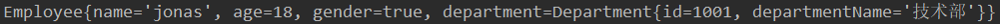

# Spring Boot 

------

## Spring Boot 入门

### 1、Spring Boot 简介

-----

​	`Spring Boot` 是为了简化 `Spring` 应用的创建、运行、调试、部署等一系列问题而衍生的产物，自动装配的特性让我们可以更好的关注业务本身而不是外部的 XML 配置文件，我们只需遵循规范，引入相关的依赖就可以轻易的搭建一个 WEB 工程。

​	未接触 `Spring Boot` 之前，搭建一个普通的 `WEB` 工程旺旺需要花费30分钟左右，如果遇到点问题可能还会耽误更长的时间，但使用了 `Spring Boot` 之后，真正体会到了什么叫分分钟搭建一个工程，从此摆脱了 XML和一大堆 jar包 的恐惧。

​	一句话总结 `Spring Boot`：简化 Spring 应用开发；整个 Spring 技术栈大整合；J2EE 开发的一站式解决方案。


### 2、环境准备

-----------

- jdk 1.8 或以上
- maven 3.3 或以上
- IDE 推荐使用 IDEA 
- Spring Boot 2.1.3


### 3、从一个 Hello World 开始

------------

#### 1.创建一个 Maven 工程，JDK选择1.8


GroupId 一般为域名逆序，ArtifactId 一般填写项目名：


进入到项目后 IDEA 在右下方会弹框，点击 Enable Auto-Import 自动导入：


#### 2. pom.xml 配置相关依赖

```xml
<?xml version="1.0" encoding="UTF-8"?>
<project xmlns="http://maven.apache.org/POM/4.0.0"
         xmlns:xsi="http://www.w3.org/2001/XMLSchema-instance"
         xsi:schemaLocation="http://maven.apache.org/POM/4.0.0 http://maven.apache.org/xsd/maven-4.0.0.xsd">
    <modelVersion>4.0.0</modelVersion>

    <groupId>com.jonas</groupId>
    <artifactId>HelloSpringBoot</artifactId>
    <version>1.0-SNAPSHOT</version>

    <!-- 继承spring-boot项目 -->
    <parent>
        <groupId>org.springframework.boot</groupId>
        <artifactId>spring-boot-starter-parent</artifactId>
        <version>2.1.3.RELEASE</version>
    </parent>


    <dependencies>
        <!-- 引入web环境的启动器 -->
        <dependency>
            <groupId>org.springframework.boot</groupId>
            <artifactId>spring-boot-starter-web</artifactId>
        </dependency>
    </dependencies>

</project>
```

#### 3. 编写一个主程序

```java
import org.springframework.boot.SpringApplication;
import org.springframework.boot.autoconfigure.SpringBootApplication;

@SpringBootApplication
public class HelloSpringBoot {
    public static void main(String[] args){
        SpringApplication.run(HelloSpringBoot.class,args);
    }
}
```

注解 `@SpringBootApplication` 用于标注一个主程序类，说明这是一个 `Spring Boot` 应用。

#### 4.编写一个 Controller

编写一个 Controller 用于处理 hello 请求，直接往页面中打印 hello world：


#### 5. 运行主程序类

测试结果：


包结构如下：


主程序所在包一定要包含所有类所在的子包，原因在后面解析。


### 4、初探 Hello World

#### 1. pom 文件

##### i.父项目

在 pom 文件中，一上来我们就引入了一个父项目：

```xml
<parent>
        <groupId>org.springframework.boot</groupId>
        <artifactId>spring-boot-starter-parent</artifactId>
        <version>2.1.3.RELEASE</version>
</parent>
```

点击`spring-boot-starter-parent`进入父项目，可以发现，父项目里面还有一个父项目 `spring-boot-dependencies`：

```xml
<parent>
        <groupId>org.springframework.boot</groupId>
        <artifactId>spring-boot-dependencies</artifactId>
        <version>2.1.3.RELEASE</version>
        <relativePath>../../spring-boot-dependencies</relativePath>
</parent>
```

在`spring-boot-dependencies`项目中，管理着一大堆 `Spring Boot` 的依赖，这是 `Spring Boot` 的版本仲裁中心，以后我们导入的依赖默认不需要写版本，因为版本的控制已经交给 `Spring Boot` 了（当然，如果你引入的依赖没有在 dependencies 里面管理着自然需要声明版本号）。

##### ii.启动器

回到 pom 文件中，除了引入了父项目以外，还定义了一个依赖：

```xml
<dependencies>
        <!-- 引入web环境的启动器 -->
        <dependency>
            <groupId>org.springframework.boot</groupId>
            <artifactId>spring-boot-starter-web</artifactId>
        </dependency>
</dependencies>
```

在没有使用 `Spring Boot` 之前，我们如果需要 web 环境则需要我们去引入相关的 jar 包或者依赖配置，然而 Spring Boot 将这里所谓的环境进行了一个整合，将所有的功能场景都抽取出来，做成一个个 `starters`（启动器），只需要在项目里面引入这些  `starter` ，相关场景的所有依赖都会导入近来。也就是说，用什么功能就导入什么场景的启动器。具体到这个例子，`spring-boot-starter-web`启动器就帮我们导入了web场景所需要的所有依赖。

#### 2.主程序类

```java
@SpringBootApplication
public class HelloSpringBoot {
    public static void main(String[] args){
        SpringApplication.run(HelloSpringBoot.class,args);
    }
}
```

`@SpringBootApplication` 用于标识在某个类上说明这个类是 `Spring Boot` 的主配置类，`Spring Boot` 就应该运行这个类的 `main` 方法来启动 `Spring Boot` 应用。

点击 `@SpringBootApplication` 注解进入源码看到：


`@SpringBootConfiguration` ：`Spring Boot` 的配置类，标注在一个类上，表示一个配置类（Spring Boot 将配置也抽取成一个类了）。

`@EnableAutoConfiguration` ：开启自动配置功能。以前我们需要配置的东西，Spring Boot 帮我们进行了自动配置，这个注解就是告诉 Spring Boot 开启自动配置功能。


`@AutoConfigurationPackage` ：自动配置包。点击进入注解：


`@Import(AutoConfigurationPackages.Registrar.class)` ：给容器导入一个组件。emmm，那么这里导入的是什么东西呢？点击 `Registrar` 进入看看：


通过计算发现，导入的包名就是我们定义的主程序类所在的包！！！

**也就是说，`@Import` 的作用就是将主配置类（使用 `@SpringBootApplication` 标注的类）所在包以及下面所有子包里面的所有组件扫到 Spring 容器中！！**

这也就说解析了前面提到的要将控制器类所在的包作为主程序类包的子包，因为它会默认扫描啊，如果放到主程序包的外面那么你的控制器就无法处理请求了，页面就是恶心的 404 了~~


### 5、一键创建 Spring Boot 工程

嘿嘿，直接上图：
 


然后填写 GAV 等信息就创建成功了，通过这种方式创建的我们就不需要手动在 pom 里面引入父项目和启动器了，父项目默认继承了，而启动器在创建前可以通过图形化界面的方式勾选具体的场景，然后在 pom 中就给我们自动引入了，方便多了。

## 二、配置文件

### 1、全局配置文件

------

在使用(上一篇最后提到的) `Spring Initalizr` 来创建项目时，在项目中会自动帮我们创建了一个配置文件 `application.properties` ：


这个就是 `Spring Boot` 应用的全局配置文件。除了我们熟悉的 ` properties` 配置文件以外，`Spring Boot` 也支持 `yml` 格式的配置文件，如果我们需要使用使用 `yml` 配置文件，就直接在 `resources` 目录下创建一个名为 `application.yml` 的配置文件即可。下面就先来简单的介绍这种 `yml` 的语法。

### 2、YML 语法

- 以 `k：（空格）v ` 来表示一对键值对，空格不能省略；以缩进来控制层级关系。

- 对于 v 而言，可以有以下表示方法：

  - 字符串，默认不需要写引号

  - 对象，Map 可以通过缩进的方式表示。也可以通过行内表达：{k1:v1,k2:v2...}

  - 数组，- 元素，也可以通过行内表示：[元素1，元素2...]

    

### 3、配置文件装配bean

#### 1. @ConfigurationProperties 装配 Bean

配置文件：

```yaml
employee:
    name: jonas
    age: 18
    gender: true
    department:
        id: 1001
        departmentName: 技术部
```

JavaBean：


注解 `ConfigurationPropertiese`：告诉 `Spring Boot` 将本类中的所有属性和配置文件中相关的配置进行绑定，通过 `prefix` 属性指定配置文件中具体的哪个对象。

在测试环境中直接注入 `Employee` 并输出：

```java
@RunWith(SpringRunner.class)
@SpringBootTest
public class SpringConfigApplicationTests {

    @Autowired
    Employee employee;

    @Test
    public void contextLoads() {
        System.out.println(employee);
    }

}
```

结果：


注意：

1.只有容器组件才能使用该注解（想想也知道，如果一个类都不在容器中，人家怎么给你注入进来呢）。

2.加上该注解后 IDE 会报个红线，具体的意思就是缺少一个配置文件的处理器，然后按照提示在 `pom` 中添加对应的依赖即可：

```xml
<dependency>
            <groupId>org.springframework.boot</groupId>
            <artifactId>spring-boot-configuration-processor</artifactId>
            <optional>true</optional>
</dependency>
```

3.`Spring Boot` 在默认情况下会加载应用的全局配置文件（`application.properties` 或者 `application.yml` ），所以上面 `@ConfigurationProperties` 指定的 `prefix` 会在全局配置里面找映射关系，但是如果将一个 `Bean` 配置在全局配置文件有点不妥当吧，所以就有了下面的方式。

#### 2.@PropertySource

`@PropertySource` 的作用是加载指定的配置文件。在 `Bean` 上加上该注解：


定义配置文件 `employee.yml` ：

```yaml
employee:
    name: jonas
    age: 18
    gender: true
    department:
        id: 1001
        departmentName: 技术部
```

测试结果与上面的一致，也是OK的。

#### 4.使用最原始的配置方式

`@ImportResource` ：导入 `Spring ` 的配置文件，通过这个注解就可以定义最原始的 `xml` 配置文件来进行装配 `Bean` 。这里不做介绍了。


#### 5.通过配置类的方式装配

**使用 `@Configuration` 来标识一个配置类，然后在类中通过 `@Bean` 标识方法，方法的返回值就是就会被添加到容器中，而这个 `Bean` 的 `id` 就是方法名。**

定义配置类，使用 `@Configuration` 标注：

```java
@Configuration
public class BeanConfig {
    @Bean
    public Employee employeeBean(){
        Department department = new Department(1001, "技术部");
        return new Employee("jonas",18,true,department);
    }
}
```

在测试环境中输出该 `Bean` ：



结果无误。


### 4、多 Prifile 环境

在实际开发中往往存在着多种环境，比如开发环境，测试环境，生产环境。然而，`Spring Boot` 也替我们想好了处理办法，就是我们在主配置文件编写的时候，文件名可以是 `application-{profile}.properties/yml` ，然后在配置文件中指定 `spring.profiles.active = dev` 指定 `profile` 。

```yaml
---
# 开发环境
server:
    port: 8083
spring:
    profiles:
        active: dev # 激活开发环境


---
# 测试环境
server:
    port: 8081
spring:
    profiles: test

---
# 生产环境
server:
    port: 8082
spring:
    profiles: prod

---
```

运行并查看日志信息：


结果就是我们指定的8083开发环境端口。


### 5、配置文件的加载位置以及加载优先级

我们都知道 `Spring Boot` 启动的时候会扫描 `application.properties` 或者 `application.yml` 配置文件作为 `Spring Boot` 的默认配置文件，那么问题来了，它会在哪里扫描呢，优先级又是怎样的呢？直接上答案：

- file: ./config/
- file:./
- classpath:/config/
- classpath:/

优先级由高到低，高优先级的配置会覆盖低优先级的配置。

