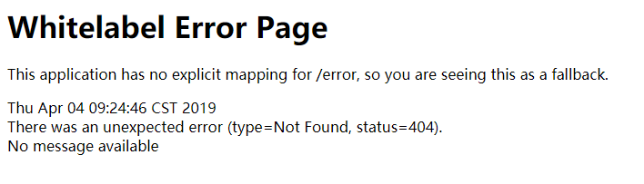
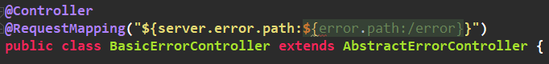

## 五、Spring Boot 异常处理

### 1. 异常处理的原理

在 `Spring Boot` 中如果访问一个不存在的资源或者请求没有映射的地址，则会抛出异常并被默认的异常处理器处理，如果在浏览器端访问，则会返回一个这样的页面：



页面的内容大致包含错误产生的时间，异常类型，状态码以及异常信息。但是如果在其他客户端上访问，则会返回 `json` 数据：

```json
{
    "timestamp": "2019-04-04T01:31:21.663+0000",
    "status": 404,
    "error": "Not Found",
    "message": "No message available",
    "path": "/123"
}
```

返回的信息大致也跟上面的相同。哦豁，`Spring Boot` 还这么智能，还能根据客户端不同而进行不同的处理，那原理到底是怎么样的呢？可以参考 `ErrorMvcAutoConfiguration` 这个类，在此类中，给容器添加了几个重要的组件：

- `DefaultErrorAttributes` 
- `BasicErrorController` 
- `ErrorPageCustomizer` 
- `DefaultErrorViewResolver ` 

`ErrorPageCustomizer` 是内部类，主要用于订制错误的响应规则，默认的情况下是发送一个 `/error` 请求：

```java
		@Override
		//注册错误页面
		public void registerErrorPages(ErrorPageRegistry errorPageRegistry) {
			ErrorPage errorPage = new ErrorPage(this.dispatcherServletPath
					.getRelativePath(this.properties.getError().getPath()));
			errorPageRegistry.addErrorPages(errorPage);
		}
```

点入 `getPath` 方法可以找到请求路径：

```java
	@Value("${error.path:/error}")
	private String path = "/error";
```

规则有了，那么谁来处理？答案就是 `BasicErrorController` 来处理的，先看源码：

```java
	@Bean
	//容器中如果没有 ErrorController 才去注册
	@ConditionalOnMissingBean(value = ErrorController.class, search = SearchStrategy.CURRENT)
	public BasicErrorController basicErrorController(ErrorAttributes errorAttributes) {
		return new BasicErrorController(errorAttributes, this.serverProperties.getError(),
				this.errorViewResolvers);
	}
```

进入到 `BasicErrorController` 中：



发现这个类就是一个普通的请求处理器，处理 `server.error.path` 配置的请求，如果没有配置，则处理 `error.path` 请求，如果也没有，最后处理 `/error` 请求。继续往下看会发现两个 `@RequestMapping` 的方法：

```java
	//处理浏览器端的请求，MediaType.TEXT_HTML_VALUE = text/html
	@RequestMapping(produces = MediaType.TEXT_HTML_VALUE)
	public ModelAndView errorHtml(HttpServletRequest request,
			HttpServletResponse response) {
		HttpStatus status = getStatus(request);
		Map<String, Object> model = Collections.unmodifiableMap(getErrorAttributes(
				request, isIncludeStackTrace(request, MediaType.TEXT_HTML)));
		response.setStatus(status.value());
		ModelAndView modelAndView = resolveErrorView(request, response, status, model);
		return (modelAndView != null) ? modelAndView : new ModelAndView("error", model);
	}

	//处理其他客户端请求，返回 json 数据
	@RequestMapping
	public ResponseEntity<Map<String, Object>> error(HttpServletRequest request) {
		Map<String, Object> body = getErrorAttributes(request,
				isIncludeStackTrace(request, MediaType.ALL));
		HttpStatus status = getStatus(request);
		return new ResponseEntity<>(body, status);
	}
```

​	具体去哪个页面是由 `DefaultErrorViewResolver ` 解析得到的。

### 2. 如何定制错误页面

有使用模板引擎的情况下；`error/状态码` 将错误页面命名为 **错误状态码.html** 放在模板引擎文件夹里面的 error 文件夹下，发生此状态码的错误就会来到对应的页面。可以使用 4xx 或 5xx 命名页面，则可以匹配 4xx 或 5xx 的所有错误（精确度优先）。如果没有使用模板引擎，静态资源文件夹下找，如果没有错误页面，就使用默认的提示。

### 3. 如何定制错误json数据

定义一个类继承 `DefaultErrorAttributes` 并且将其添加到容器中，重写 `getErrorAttributes` 方法：

```java
@Override
public Map<String, Object> getErrorAttributes(RequestAttributes requestAttributes,boolean includeStackTrace) {
	Map<String, Object> map = super.getErrorAttributes(requestAttributes,includeStackTrace);
	map.put("name","jonas");
	return map;
}
```


