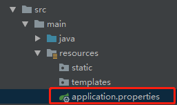
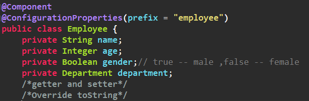
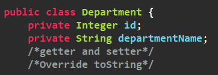
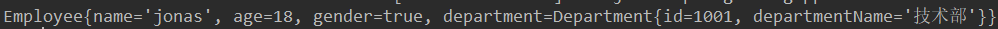
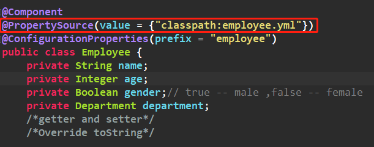
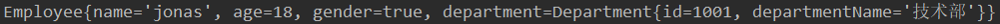
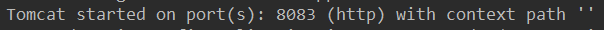

## 二、配置文件

### 1、全局配置文件

------

在使用(上一篇最后提到的) `Spring Initalizr` 来创建项目时，在项目中会自动帮我们创建了一个配置文件 `application.properties` ：




这个就是 `Spring Boot` 应用的全局配置文件。除了我们熟悉的 ` properties` 配置文件以外，`Spring Boot` 也支持 `yml` 格式的配置文件，如果我们需要使用使用 `yml` 配置文件，就直接在 `resources` 目录下创建一个名为 `application.yml` 的配置文件即可。下面就先来简单的介绍这种 `yml` 的语法。

### 2、YML 语法

- 以 `k：（空格）v ` 来表示一对键值对，空格不能省略；以缩进来控制层级关系。

- 对于 v 而言，可以有以下表示方法：

  - 字符串，默认不需要写引号

  - 对象，Map 可以通过缩进的方式表示。也可以通过行内表达：{k1:v1,k2:v2...}

  - 数组，- 元素，也可以通过行内表示：[元素1，元素2...]

    

### 3、配置文件装配bean

#### 1. @ConfigurationProperties 装配 Bean

配置文件：

```yaml
employee:
    name: jonas
    age: 18
    gender: true
    department:
        id: 1001
        departmentName: 技术部
```

JavaBean：





注解 `ConfigurationPropertiese`：告诉 `Spring Boot` 将本类中的所有属性和配置文件中相关的配置进行绑定，通过 `prefix` 属性指定配置文件中具体的哪个对象。

在测试环境中直接注入 `Employee` 并输出：

```java
@RunWith(SpringRunner.class)
@SpringBootTest
public class SpringConfigApplicationTests {

    @Autowired
    Employee employee;

    @Test
    public void contextLoads() {
        System.out.println(employee);
    }

}
```

结果：



注意：

1.只有容器组件才能使用该注解（想想也知道，如果一个类都不在容器中，人家怎么给你注入进来呢）。

2.加上该注解后 IDE 会报个红线，具体的意思就是缺少一个配置文件的处理器，然后按照提示在 `pom` 中添加对应的依赖即可：

```xml
<dependency>
            <groupId>org.springframework.boot</groupId>
            <artifactId>spring-boot-configuration-processor</artifactId>
            <optional>true</optional>
</dependency>
```

3.`Spring Boot` 在默认情况下会加载应用的全局配置文件（`application.properties` 或者 `application.yml` ），所以上面 `@ConfigurationProperties` 指定的 `prefix` 会在全局配置里面找映射关系，但是如果将一个 `Bean` 配置在全局配置文件有点不妥当吧，所以就有了下面的方式。

#### 2.@PropertySource

`@PropertySource` 的作用是加载指定的配置文件。在 `Bean` 上加上该注解：



定义配置文件 `employee.yml` ：

```yaml
employee:
    name: jonas
    age: 18
    gender: true
    department:
        id: 1001
        departmentName: 技术部
```

测试结果与上面的一致，也是OK的。

#### 4.使用最原始的配置方式

`@ImportResource` ：导入 `Spring ` 的配置文件，通过这个注解就可以定义最原始的 `xml` 配置文件来进行装配 `Bean` 。这里不做介绍了。


#### 5.通过配置类的方式装配

**使用 `@Configuration` 来标识一个配置类，然后在类中通过 `@Bean` 标识方法，方法的返回值就是就会被添加到容器中，而这个 `Bean` 的 `id` 就是方法名。**

定义配置类，使用 `@Configuration` 标注：

```java
@Configuration
public class BeanConfig {
    @Bean
    public Employee employeeBean(){
        Department department = new Department(1001, "技术部");
        return new Employee("jonas",18,true,department);
    }
}
```

在测试环境中输出该 `Bean` ：



结果无误。


### 4、多 Prifile 环境

在实际开发中往往存在着多种环境，比如开发环境，测试环境，生产环境。然而，`Spring Boot` 也替我们想好了处理办法，就是我们在主配置文件编写的时候，文件名可以是 `application-{profile}.properties/yml` ，然后在配置文件中指定 `spring.profiles.active = dev` 指定 `profile` 。

```yaml
---
# 开发环境
server:
    port: 8083
spring:
    profiles:
        active: dev # 激活开发环境


---
# 测试环境
server:
    port: 8081
spring:
    profiles: test

---
# 生产环境
server:
    port: 8082
spring:
    profiles: prod

---
```

运行并查看日志信息：



结果就是我们指定的8083开发环境端口。


### 5、配置文件的加载位置以及加载优先级

我们都知道 `Spring Boot` 启动的时候会扫描 `application.properties` 或者 `application.yml` 配置文件作为 `Spring Boot` 的默认配置文件，那么问题来了，它会在哪里扫描呢，优先级又是怎样的呢？直接上答案：

- file: ./config/
- file:./
- classpath:/config/
- classpath:/

优先级由高到低，高优先级的配置会覆盖低优先级的配置。
